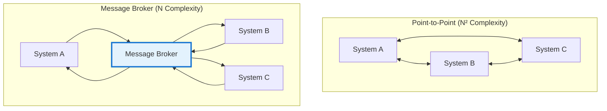
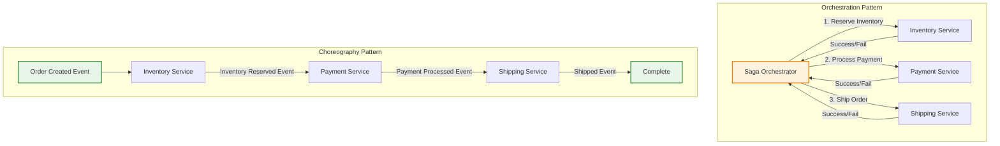
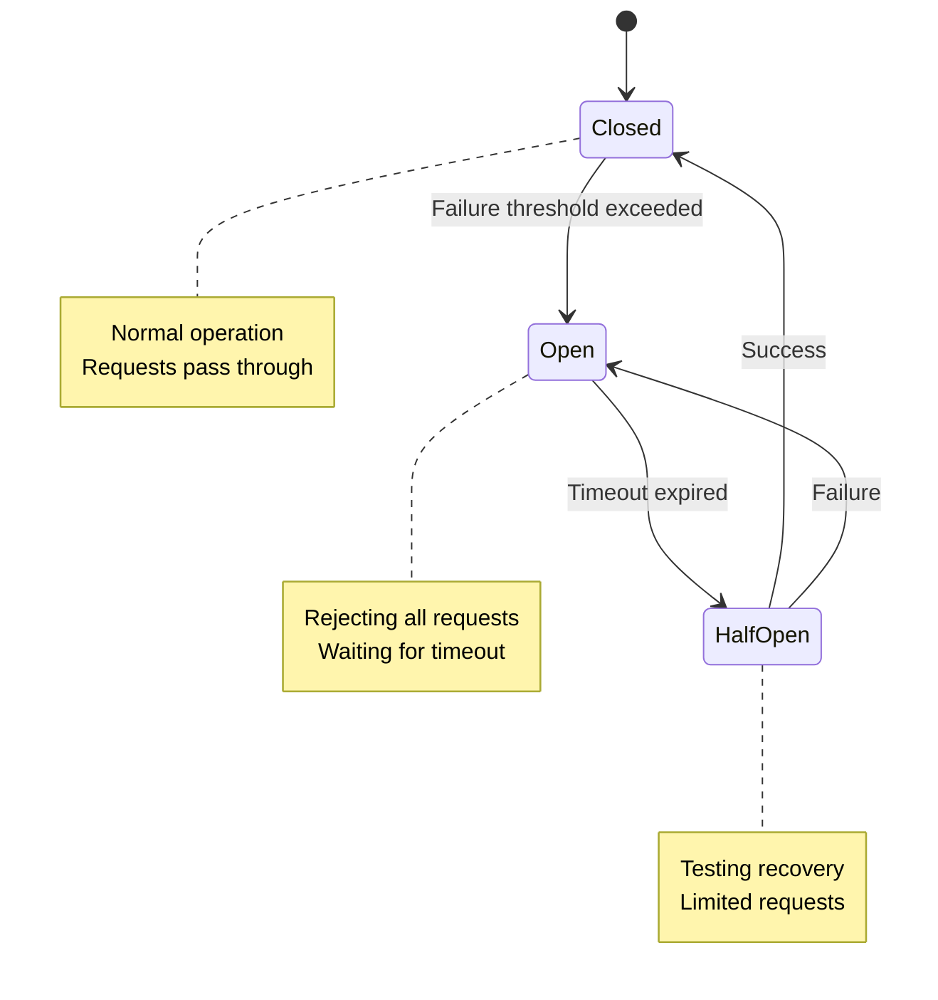
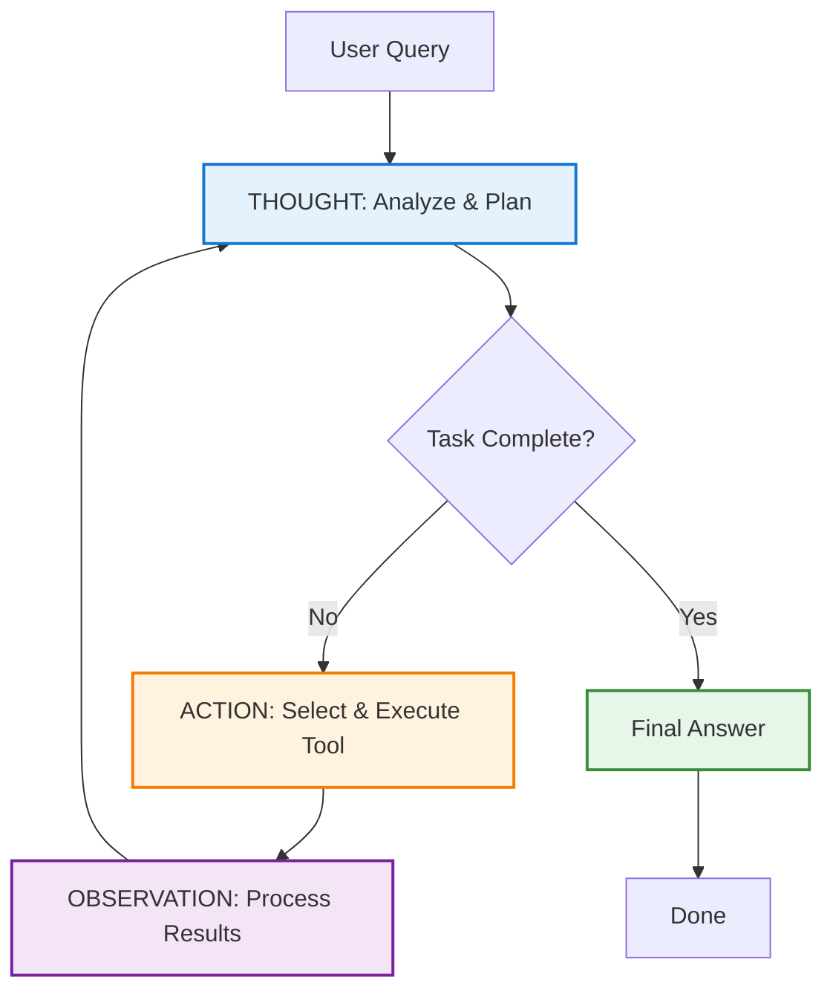

# Software Design: The Art of Simplicity

In 1998, Edward de Bono published *Simplicity*, a compelling treatise on the deliberate pursuit of simplification across all domains of human endeavor. His central thesis—that simplicity is not discovered but designed—resonates powerfully with modern software engineering, where complexity has become the primary adversary of maintainability, scalability, and reliability.

As distributed systems, enterprise integration patterns, and agentic AI architectures proliferate across the industry, the imperative for simplicity has never been more urgent. This essay synthesizes de Bono's ten rules of simplicity with contemporary software design patterns to articulate a coherent philosophy for building systems that are both sophisticated and comprehensible.

---

## Part I: De Bono's Ten Rules of Simplicity

De Bono's framework provides a philosophical foundation for approaching complexity. Each rule offers both a mindset and a method for systematic simplification.

### Rule 1: Place a High Value on Simplicity

Simplicity must be elevated from a secondary objective to a first-order design principle. When systems function adequately, the impetus to simplify vanishes—yet this complacency accumulates technical debt that compounds over time.

**Software Application**: In distributed systems, this manifests as the difference between accepting "it works" versus demanding "it works simply." Consider the evolution from monolithic architectures to microservices: the initial motivation was not failure but the recognition that simplicity at scale requires deliberate architectural choices.

The AWS Well-Architected Framework exemplifies this principle by establishing operational excellence, security, reliability, performance efficiency, cost optimization, and sustainability as equally weighted pillars—not afterthoughts.

### Rule 2: Be Determined to Seek Simplicity

Simplicity demands perseverance. It is far easier to accumulate features, dependencies, and workarounds than to resist them. This rule requires cultivating what de Bono calls "aggressive simplification"—actively questioning every component, every abstraction, every line of code.

**Software Application**: In enterprise integration, this translates to rigorous pattern selection. The Message Channel, Message Router, and Content-Based Router patterns from Hohpe and Woolf's *Enterprise Integration Patterns* succeed precisely because they resist the temptation to create bespoke integration logic for every use case. Instead, they provide reusable, composable building blocks.

At Amazon, the "two-pizza team" rule and the mandate to write six-page narratives instead of PowerPoint decks both exemplify determined simplification, forcing clarity of thought and limiting coordination overhead.

### Rule 3: Understand the Matter Very Well

Superficial understanding produces superficial simplification. Genuine simplicity emerges only from deep comprehension of both the problem domain and the solution space. As Leslie Lamport observed in his work on distributed systems, "You can't reduce what you don't understand."

**Software Application**: This rule is fundamental to distributed consensus algorithms. Paxos and Raft appear simple in their final formulation, but both required profound understanding of failure modes, network partitions, and state machine replication. Raft's explicit goal was to be more understandable than Paxos—a meta-application of this rule to algorithm design itself.

In agentic AI systems, understanding the nuances of tool use, context management, and multi-step reasoning is prerequisite to designing simple orchestration patterns like ReAct (Reason and Act) or hierarchical task decomposition.

### Rule 4: Design Alternatives and Possibilities

Simplicity is discovered through exploration, not optimization of the first solution. De Bono emphasizes that designing "what may be" rather than merely analyzing "what is" unlocks novel simplifications.

**Software Application**: The Saga pattern for distributed transactions illustrates this perfectly. Rather than forcing distributed ACID transactions via two-phase commit (2PC) ”the "obvious solution” the Saga pattern explores an alternative: orchestrating compensating transactions to achieve eventual consistency. This shift from synchronous coordination to asynchronous compensation yields dramatically simpler failure handling.

Similarly, in agentic AI, the emergence of the ReAct pattern represents exploration beyond simple prompt-completion. By alternating between reasoning (thought) and action (tool use), agents achieve complex behavior through simple, iterative loops rather than monolithic planning.

### Rule 5: Challenge and Discard Existing Elements

Not everything that was necessary in the past remains necessary today. De Bono urges us to question every component: "If we could not justify its existence, why is it here?"

**Software Application**: The transition from ESB (Enterprise Service Bus) architectures to event-driven microservices exemplifies this rule. ESBs centralized integration logic a reasonable choice when orchestration was the dominant pattern. But as systems scaled, the ESB became a bottleneck. Challenging its necessity led to choreography-based patterns using message brokers like Kafka, where services react to events autonomously.

In distributed systems, the shift from leader-based replication to leaderless architectures (as in Dynamo and Cassandra) similarly challenged the assumption that coordination requires a single authority.

### Rule 6: Be Prepared to Start Over Again

When incremental improvements fail to yield simplicity, wholesale redesign may be necessary. This rule acknowledges that sunk cost is an emotional barrier, not a technical one.

**Software Application**: Kubernetes represents a radical restart in container orchestration, superseding earlier systems like Mesos and Docker Swarm. Rather than extending existing paradigms, Kubernetes introduced declarative configuration, reconciliation loops, and the control plane/data plane separation—concepts that required rethinking orchestration from first principles.

In AI systems, the shift from fine-tuning to retrieval-augmented generation (RAG) similarly represents a restart: rather than embedding all knowledge in model weights, RAG separates retrieval from generation, yielding simpler, more maintainable systems.

### Rule 7: Use Concepts

Concepts abstract away implementation details, enabling reasoning at higher levels. De Bono argues that conceptual thinking is the most powerful simplification tool because it collapses multiple specific cases into a single general principle.

**Software Application**: The concept of "eventual consistency" unifies diverse distributed systems patterns—gossip protocols, conflict-free replicated data types (CRDTs), and anti-entropy mechanisms—under a single conceptual umbrella. This allows engineers to reason about correctness without exhaustive enumeration of failure scenarios.

In agentic AI, the concept of "tool use" abstracts over function calling, API invocation, and code execution. Whether an agent queries a database, calls a REST API, or executes Python code, the conceptual model remains identical: the agent identifies a capability gap and invokes an external tool to address it.

### Rule 8: Break Things Down into Smaller Units

Decomposition is simplification through reduction. Complex problems become tractable when divided into independent, cohesive subproblems.

**Software Application**: The microservices architecture operationalizes this rule by decomposing monoliths into bounded contexts, each with its own data model, API, and deployment lifecycle. The Circuit Breaker pattern further decomposes failure handling into three discrete states (Closed, Open, Half-Open), each with well-defined transitions.

In multi-agent AI systems, hierarchical decomposition patterns break complex tasks into subtasks delegated to specialized agents. For example, a research agent might decompose "analyze competitive landscape" into "identify competitors," "extract financials," and "synthesize findings" each handled by a specialist.

### Rule 9: Trade Off Other Values for Simplicity

Simplicity sometimes conflicts with optimization, feature completeness, or backward compatibility. De Bono argues that simplicity must occasionally take precedence—even at the cost of other desirable attributes.

**Software Application**: The CAP theorem formalizes this tradeoff in distributed systems: consistency, availability, and partition tolerance cannot all be maximized simultaneously. Choosing AP (availability and partition tolerance) over CP (consistency and partition tolerance) represents a deliberate tradeoff where simplicity of operation (always writable) is prioritized over strong consistency.

In software design, the YAGNI principle ("You Aren't Gonna Need It") embodies this rule by trading potential future flexibility for present simplicity rejecting speculative generality.

### Rule 10: Know for Whose Sake Simplicity Is Being Designed

Simplicity is context-dependent. What simplifies the developer experience may complicate operations; what simplifies the API may complicate the implementation. De Bono insists we identify the primary beneficiary.

**Software Application**: GraphQL simplifies client-side data fetching by allowing clients to specify precisely what they need, but it complicates server-side resolver logic and query optimization. The design prioritizes client simplicity.

Conversely, the Sidecar pattern (as used in service meshes like Istio) complicates deployment (each service runs alongside a proxy) to simplify application code (cross-cutting concerns like retries, circuit breaking, and observability are externalized).

In agentic AI, frameworks like LangGraph prioritize developer simplicity (declarative graph definitions) over runtime efficiency (graph compilation and execution overhead).

---

## Part II: Simplicity in Enterprise Integration Patterns

Enterprise integration has evolved through several paradigm shifts, each representing a search for simpler coordination models at scale.

### From Point-to-Point to Message-Oriented Middleware

Early integration relied on point-to-point connections between systems—a quadratic complexity nightmare (N systems require N(N-1)/2 connections). The introduction of message brokers linearized this to N connections, each system integrating once with the broker.



**Key Patterns**:
- **Message Channel**: Decouples sender and receiver via an intermediary queue or topic.
- **Publish-Subscribe**: Allows one-to-many communication without tight coupling, enabling new subscribers to join without modifying publishers.
- **Content-Based Router**: Routes messages based on content rather than hard-coded logic, reducing configuration complexity.

These patterns embody de Bono's Rule 7 (use concepts) by elevating "message" to a first-class abstraction.

### From ESB to Event-Driven Choreography

Enterprise Service Buses centralized orchestration logic, creating a single point of failure and a bottleneck for change. Event-driven architectures distribute coordination by having services react to events asynchronously.

**Choreography vs. Orchestration in Saga Pattern**:
- **Orchestration**: A central coordinator explicitly invokes each step. Simpler to understand and debug but introduces a single point of failure.
- **Choreography**: Each service listens for events and triggers the next step. More resilient but harder to trace and reason about.



The choice between these patterns exemplifies de Bono's Rule 9 (trade off other values): orchestration trades operational complexity for cognitive simplicity; choreography does the reverse.

### The Role of Idempotency and Compensation

Distributed transactions are notoriously complex. The Saga pattern simplifies them by replacing ACID guarantees with compensating transactions. This requires:
- **Idempotency**: Operations can be safely retried without side effects.
- **Compensation Logic**: Each step has a corresponding rollback operation.

**Java Example: Saga Orchestration**:

```java
import java.util.*;
import java.util.concurrent.CompletableFuture;

public class SagaOrchestrator {
    private List<SagaStep> steps;
    private List<SagaStep> completedSteps;
    
    public SagaOrchestrator() {
        this.steps = new ArrayList<>();
        this.completedSteps = new ArrayList<>();
    }
    
    // Define saga steps with compensation logic
    public void addStep(String stepName, 
                       Function<SagaContext> action,
                       Function<SagaContext> compensation) {
        steps.add(new SagaStep(stepName, action, compensation));
    }
    
    // Execute saga with automatic rollback on failure
    public CompletableFuture<SagaResult> execute(SagaContext context) {
        return executeStep(context, 0);
    }
    
    private CompletableFuture<SagaResult> executeStep(SagaContext context, int stepIndex) {
        if (stepIndex >= steps.size()) {
            return CompletableFuture.completedFuture(
                new SagaResult(true, "Saga completed successfully", completedSteps)
            );
        }
        
        SagaStep currentStep = steps.get(stepIndex);
        
        return CompletableFuture.supplyAsync(() -> {
            try {
                System.out.println("Executing: " + currentStep.name);
                Object result = currentStep.action.apply(context);
                context.put(currentStep.name, result);
                completedSteps.add(currentStep);
                return true;
            } catch (Exception e) {
                System.err.println("Failed at step: " + currentStep.name);
                System.err.println("Rolling back " + completedSteps.size() + " completed steps");
                
                // COMPENSATION: Rollback in reverse order
                for (int i = completedSteps.size() - 1; i >= 0; i--) {
                    SagaStep step = completedSteps.get(i);
                    try {
                        System.out.println("Compensating: " + step.name);
                        step.compensation.apply(context);
                    } catch (Exception compensationError) {
                        System.err.println("Compensation failed for: " + step.name);
                    }
                }
                throw e;
            }
        }).thenCompose(success -> executeStep(context, stepIndex + 1));
    }
    
    // Example usage
    public static void main(String[] args) {
        SagaOrchestrator saga = new SagaOrchestrator();
        SagaContext context = new SagaContext();
        
        // Step 1: Reserve inventory
        saga.addStep(
            "Reserve Inventory",
            ctx -> {
                System.out.println("    Reserving 5 units of product SKU-123");
                ctx.put("reservationId", "RES-001");
                return "RES-001";
            },
            ctx -> {
                System.out.println("    Releasing reserved inventory");
                return true;
            }
        );
        
        // Step 2: Process payment
        saga.addStep(
            "Process Payment",
            ctx -> {
                System.out.println("    Charging $99.99 to card");
                ctx.put("transactionId", "TXN-001");
                return "TXN-001";
            },
            ctx -> {
                System.out.println("    Refunding $99.99");
                return true;
            }
        );
        
        // Step 3: Ship order
        saga.addStep(
            "Ship Order",
            ctx -> {
                System.out.println("    Creating shipment with carrier");
                // Simulated failure
                if (Math.random() > 0.5) {
                    throw new RuntimeException("Carrier service unavailable");
                }
                ctx.put("trackingId", "TRACK-001");
                return "TRACK-001";
            },
            ctx -> {
                System.out.println("    Canceling shipment");
                return true;
            }
        );
        
        saga.execute(context).thenAccept(result -> {
            System.out.println("\n=== SAGA RESULT ===");
            System.out.println("Success: " + result.success);
            System.out.println("Message: " + result.message);
            System.out.println("Completed Steps: " + result.completedSteps.size());
        });
    }
}

class SagaStep {
    String name;
    Function<SagaContext, Object> action;
    Function<SagaContext, Boolean> compensation;
    
    SagaStep(String name, Function<SagaContext, Object> action, 
             Function<SagaContext, Boolean> compensation) {
        this.name = name;
        this.action = action;
        this.compensation = compensation;
    }
}

class SagaContext extends HashMap<String, Object> {}

class SagaResult {
    boolean success;
    String message;
    List<SagaStep> completedSteps;
    
    SagaResult(boolean success, String message, List<SagaStep> completedSteps) {
        this.success = success;
        this.message = message;
        this.completedSteps = completedSteps;
    }
}
```

This approach aligns with Rule 5 (discard existing elements) by rejecting traditional distributed transactions in favor of application-level orchestration.

---

## Part III: Simplicity in Distributed System Design Patterns

Distributed systems confront inherent complexity: partial failures, network delays, clock skew, and concurrent state mutations. Design patterns simplify by providing reusable solutions to recurring problems.

### Replication and Consistency

**Pattern**: Replication improves availability and fault tolerance by maintaining copies of data across nodes.

**Simplicity Lens**: Rather than pursuing strong consistency everywhere, systems like Cassandra and DynamoDB adopt tunable consistency—allowing developers to trade consistency for availability on a per-request basis. This simplifies reasoning by making tradeoffs explicit.

**De Bono Rule Applied**: Rule 9 (trade off other values). Strong consistency is sacrificed for operational simplicity and availability.

### Sharding (Partitioning)

**Pattern**: Sharding distributes data across nodes based on a partition key (e.g., user ID, geographic region).

**Simplicity Lens**: By ensuring each shard operates independently, sharding eliminates cross-node coordination for most operations. However, it complicates query patterns that span shards (e.g., joins, aggregations).

**De Bono Rule Applied**: Rule 10 (know for whose sake). Sharding simplifies write scalability at the cost of query complexity—prioritizing operational simplicity over analytical simplicity.

### Circuit Breaker

**Pattern**: Monitors calls to a service and "trips" (rejects requests) when failures exceed a threshold, preventing cascading failures.



**Simplicity Lens**: The pattern decomposes failure handling into three states:
1. **Closed**: Normal operation.
2. **Open**: Rejecting all requests after repeated failures.
3. **Half-Open**: Testing recovery by allowing limited requests.

**Python Implementation Example**:

```python
import time
from enum import Enum
from typing import Callable, Any
from datetime import datetime, timedelta

class CircuitBreakerState(Enum):
    CLOSED = "closed"
    OPEN = "open"
    HALF_OPEN = "half_open"

class CircuitBreaker:
    """
    Circuit Breaker pattern: Prevent cascading failures by monitoring service health.
    
    States:
    - CLOSED: Normal operation, requests pass through
    - OPEN: Too many failures, reject all requests
    - HALF_OPEN: Testing recovery, allow limited requests
    """
    
    def __init__(self, 
                 failure_threshold: int = 5,
                 recovery_timeout: int = 60,
                 expected_exception: Exception = Exception):
        self.failure_threshold = failure_threshold
        self.recovery_timeout = recovery_timeout
        self.expected_exception = expected_exception
        
        self.failure_count = 0
        self.success_count = 0
        self.last_failure_time = None
        self.state = CircuitBreakerState.CLOSED
    
    def call(self, func: Callable, *args, **kwargs) -> Any:
        """
        Execute function with circuit breaker protection.
        """
        if self.state == CircuitBreakerState.OPEN:
            if self._should_attempt_reset():
                self.state = CircuitBreakerState.HALF_OPEN
                print(f"  [Circuit Breaker] State: {self.state.value}")
            else:
                raise Exception(f"Circuit breaker is OPEN. Try again in {self._time_until_retry()}s")
        
        try:
            result = func(*args, **kwargs)
            self._on_success()
            return result
        except self.expected_exception as e:
            self._on_failure()
            raise e
    
    def _on_success(self):
        """Reset failure count on successful call."""
        self.failure_count = 0
        
        if self.state == CircuitBreakerState.HALF_OPEN:
            self.state = CircuitBreakerState.CLOSED
            print(f"  [Circuit Breaker] State: {self.state.value} (recovered)")
    
    def _on_failure(self):
        """Increment failure count and trip if threshold exceeded."""
        self.failure_count += 1
        self.last_failure_time = datetime.now()
        
        if self.failure_count >= self.failure_threshold:
            self.state = CircuitBreakerState.OPEN
            print(f"  [Circuit Breaker] State: {self.state.value} ({self.failure_count} failures)")
    
    def _should_attempt_reset(self) -> bool:
        """Check if enough time has passed to attempt recovery."""
        return (datetime.now() - self.last_failure_time).seconds >= self.recovery_timeout
    
    def _time_until_retry(self) -> int:
        """Calculate seconds until circuit can attempt recovery."""
        elapsed = (datetime.now() - self.last_failure_time).seconds
        return max(0, self.recovery_timeout - elapsed)

# Example usage
def unstable_api_call(call_num: int) -> str:
    """Simulated API that fails intermittently."""
    if call_num % 3 == 0:  # Fail every 3rd call
        raise ConnectionError("Service temporarily unavailable")
    return f"Success: Call {call_num}"

# Create circuit breaker for the API
breaker = CircuitBreaker(
    failure_threshold=3,
    recovery_timeout=5,
    expected_exception=ConnectionError
)

# Test the circuit breaker
print("Testing Circuit Breaker Pattern\n")
for i in range(1, 10):
    try:
        result = breaker.call(unstable_api_call, i)
        print(f"Call {i}: ✓ {result}")
    except Exception as e:
        print(f"Call {i}: ✗ {type(e).__name__}: {str(e)}")
    
    time.sleep(0.5)
```

**De Bono Rule Applied**: Rule 8 (break into smaller units). Complex failure scenarios are reduced to state transitions with clear semantics.

### Leader Election

**Pattern**: Ensures a single node coordinates critical tasks (e.g., managing writes, distributing work).

**Simplicity Lens**: By centralizing coordination, leader election simplifies distributed decision-making. Algorithms like Raft achieve this through clear roles (leader, follower, candidate) and majority voting.

**De Bono Rule Applied**: Rule 7 (use concepts). The concept of "leader" abstracts over diverse coordination tasks.

### Write-Ahead Log (WAL)

**Pattern**: Logs every state change to disk before applying it, ensuring durability and crash recovery.

**Simplicity Lens**: WAL trades write latency for conceptual simplicity—recovery is simply replaying the log. This unifies failure handling under a single mechanism.

**De Bono Rule Applied**: Rule 3 (understand deeply). WAL works because it deeply understands the failure model: memory is volatile, disk is durable.

**Challenges**: Implementations must address:
- **Performance**: Batching and async flushing to mitigate disk I/O overhead.
- **Data Corruption**: CRC checksums to detect corrupted log entries.
- **Storage Growth**: Segmented logs and low-water marks to discard obsolete entries.
- **Duplicates**: Idempotent operations or unique transaction IDs to handle replay.

### Saga Pattern (Revisited)

**Orchestration**: A central service coordinates the transaction sequence and compensating logic. Simpler to trace but a single point of failure.

**Choreography**: Services communicate via events, each responsible for listening and reacting. No single failure point but harder to debug.

**Simplicity Lens**: Orchestration simplifies understanding; choreography simplifies operations. Neither is universally simpler—context determines the appropriate choice (Rule 10).

---

## Part IV: Simplicity in Agentic AI Design Patterns

Agentic AI systems where language models autonomously plan, reason, and act introduce novel complexity: dynamic tool invocation, multi-step reasoning, context management, and inter-agent coordination. Design patterns emerging in this domain prioritize simplicity through modularity, composability, and clear abstractions.

### ReAct: Reason and Act

**Pattern**: The agent alternates between reasoning (analyzing what to do next) and acting (invoking tools or external APIs), iterating until task completion.

**Architecture Diagram**:


**Example Flow**:
- **THOUGHT**: "I need to check the current weather in Seattle"
- **ACTION**: Call `weather_api.get_current("Seattle")`
- **OBSERVATION**: `{"temp": 45, "condition": "Rainy"}`
- **THOUGHT**: "I have the answer, task complete"
- **Answer**: "The current weather in Seattle is 45°F and rainy"
```

**Python Implementation Example**:

```python
import anthropic
import json

client = anthropic.Anthropic()

# Define available tools for the agent
tools = [
    {
        "name": "query_database",
        "description": "Query a relational database",
        "input_schema": {
            "type": "object",
            "properties": {
                "query": {"type": "string", "description": "SQL query"},
                "table": {"type": "string", "description": "Table name"}
            },
            "required": ["query", "table"]
        }
    },
    {
        "name": "call_api",
        "description": "Call an external REST API",
        "input_schema": {
            "type": "object",
            "properties": {
                "endpoint": {"type": "string"},
                "method": {"type": "string", "enum": ["GET", "POST"]},
                "params": {"type": "object"}
            },
            "required": ["endpoint", "method"]
        }
    },
    {
        "name": "summarize_text",
        "description": "Summarize long text content",
        "input_schema": {
            "type": "object",
            "properties": {
                "text": {"type": "string"},
                "max_length": {"type": "integer", "description": "Max summary length in words"}
            },
            "required": ["text"]
        }
    }
]

def react_agent(user_query: str, max_iterations: int = 10) -> str:
    """
    ReAct agent loop: Iteratively THINK ACT OBSERVE until task complete.
    """
    messages = [{"role": "user", "content": user_query}]
    final_response = None
    
    for iteration in range(max_iterations):
        print(f"\n{'='*60}")
        print(f"Iteration {iteration + 1}")
        print('='*60)
        
        # THOUGHT: Get agent reasoning and next action
        response = client.messages.create(
            model="claude-3-5-sonnet-20241022",
            max_tokens=1024,
            tools=tools,
            messages=messages
        )
        
        # Print agent's thought process
        for block in response.content:
            if hasattr(block, 'text'):
                print(f"THOUGHT:\n{block.text}")
        
        # Check if agent is done reasoning
        if response.stop_reason == "end_turn":
            for block in response.content:
                if hasattr(block, 'text'):
                    final_response = block.text
            break
        
        # ACTION: Agent invokes tools
        if response.stop_reason == "tool_use":
            messages.append({"role": "assistant", "content": response.content})
            tool_results = []
            
            for block in response.content:
                if block.type == "tool_use":
                    tool_name = block.name
                    tool_input = block.input
                    
                    print(f"\nACTION: {tool_name}")
                    print(f"Input: {json.dumps(tool_input, indent=2)}")
                    
                    # OBSERVATION: Simulate tool execution
                    observation = execute_tool(tool_name, tool_input)
                    print(f"OBSERVATION:\n{observation}")
                    
                    tool_results.append({
                        "type": "tool_result",
                        "tool_use_id": block.id,
                        "content": observation
                    })
            
            messages.append({"role": "user", "content": tool_results})
    
    return final_response or "No response generated"

def execute_tool(tool_name: str, tool_input: dict) -> str:
    """Simulate tool execution."""
    if tool_name == "query_database":
        return f"""Query result from table '{tool_input['table']}':
        - 42 records matched
        - Query execution time: 145ms
        - Sample results: [user_id: 123, status: active], [user_id: 456, status: inactive]"""
    
    elif tool_name == "call_api":
        return f"""API response from {tool_input['endpoint']}:
        - Status: 200 OK
        - Response time: 243ms
        - Data: {{"status": "success", "records": 15, "timestamp": "2025-12-23T21:45:00Z"}}"""
    
    elif tool_name == "summarize_text":
        return """Summary generated:
        The comprehensive analysis reveals three key findings: market growth of 15% YoY,
        customer retention improved by 8 points, and operational efficiency gains of 12%.
        Strategic recommendations focus on scaling high-margin segments and optimizing cost structure."""
    
    return "Unknown tool"

# Usage example
if __name__ == "__main__":
    query = "Analyze customer data from California, call the market API for regional trends, and summarize findings"
    result = react_agent(query)
    print(f"\n\nFINAL RESPONSE:\n{result}")
```

**Simplicity Lens**: ReAct decomposes complex problem-solving into a simple loop. Rather than requiring the agent to plan exhaustively upfront, it interleaves thought and action—mirroring human problem-solving.

**De Bono Rule Applied**: Rule 8 (break into smaller units). Multi-step reasoning is decomposed into discrete thought-action pairs.

**Tradeoffs**: Each iteration requires an LLM call, increasing latency and cost. However, this trades performance for transparency and debuggability—every reasoning step is observable.

### Sequential Coordination

**Pattern**: Tasks are executed in strict sequence, with each step depending on the output of the previous step.

**Simplicity Lens**: Sequential workflows eliminate concurrency management, making them trivially debuggable. Suitable for tasks with clear dependencies (e.g., "research topic, then summarize findings, then generate report").

**De Bono Rule Applied**: Rule 2 (determined simplification). Resisting the urge to parallelize prematurely keeps the workflow simple.

### Multi-Agent Collaboration

**Pattern**: Specialized agents (e.g., researcher, analyst, writer) collaborate on a task, coordinated by a supervisor agent.

**Simplicity Lens**: By decomposing capabilities into specialist agents, each agent's logic remains simple. The supervisor handles routing and aggregation.

**De Bono Rule Applied**: Rule 7 (use concepts). The concept of "delegation" unifies inter-agent communication regardless of task type.

**Challenges**: Coordination overhead scales with agent count. Simplicity requires clear role definitions and minimal inter-agent dependencies.

### Tool Use and Function Calling

**Pattern**: Agents augment their capabilities by invoking external tools (databases, APIs, code interpreters).

**Simplicity Lens**: Rather than embedding all knowledge in the model, tool use externalizes retrieval and computation. This separates concerns: the model reasons about *what* to invoke; the tool handles *how*.

**De Bono Rule Applied**: Rule 5 (discard existing elements). Tool use discards the need for exhaustive fine-tuning by delegating factual recall to retrieval systems.

**Implementation**: Modern frameworks (LangChain, LangGraph, AutoGen, CrewAI) standardize tool interfaces, ensuring agents can invoke tools uniformly regardless of backend implementation.

### Reflection and Self-Correction

**Pattern**: Agents critique their own outputs and iteratively refine them.

**Simplicity Lens**: Reflection loops simplify quality control by replacing complex post-processing with iterative refinement. The agent asks, "Is this output correct? How can I improve it?"

**De Bono Rule Applied**: Rule 4 (design alternatives). Reflection generates alternative formulations, selecting the best through self-evaluation.

---

## Part V: A Synthesis ”The Simplicity Design Framework

Drawing from de Bono's philosophy and contemporary software patterns, we can articulate a six-step framework for designing simpler systems:

### 1. Establish Simplicity as a First-Order Constraint

Treat simplicity as non-negotiable. In architectural decision records (ADRs), explicitly state how each decision reduces or manages complexity. Reject proposals that increase complexity without proportional value.

**Example**: When evaluating microservices decomposition, ask: "Does splitting this service reduce overall system complexity, or merely relocate it?" If coordination overhead exceeds the simplification benefit, reject the split.

### 2. Model the Domain Deeply Before Designing

Invest time in understanding invariants, failure modes, and user needs. Premature abstraction yields brittle simplicity apparent simplicity that collapses under edge cases.

**Example**: In distributed systems, understand CAP theorem implications before choosing a database. A team that prioritizes availability over consistency without understanding partition scenarios will build fragile systems.

### 3. Explore Multiple Designs

Generate at least three distinct approaches before converging. This prevents anchoring bias and surfaces non-obvious simplifications.

**Example**: When designing an integration layer, evaluate point-to-point, ESB, and event-driven choreography before selecting. Each reveals different complexity tradeoffs.

### 4. Decompose Ruthlessly

Break problems into independent, cohesive units. Apply the Single Responsibility Principle not just to classes but to services, agents, and workflows.

**Example**: In agentic AI, decompose "analyze competitor landscape" into "identify competitors," "extract financials," "compare metrics," and "generate report" each delegated to a specialist agent.

### 5. Standardize Through Patterns

Use established patterns rather than bespoke solutions. Patterns are simplicity distilled, they encode expert knowledge and have been battle-tested across contexts.

**Example**: Use Circuit Breaker for failure handling, Saga for distributed transactions, and ReAct for agentic reasoning. Resist the temptation to "improve" the pattern unless you have evidence of its inadequacy.

### 6. Continuously Challenge and Prune

Regularly audit systems to identify and eliminate unnecessary components. Treat every dependency, every configuration parameter, and every abstraction as suspect until justified.

**Example**: In microservices, periodically ask: "Which services could be merged without loss of modularity?" Over-decomposition is as harmful as under-decomposition.

---

## Conclusion: Simplicity as Discipline

Edward de Bono's *Simplicity* posits that simplicity is not a destination but a discipline—a relentless, deliberate practice of design and redesign. In software engineering, this discipline manifests as pattern selection, architectural humility, and the courage to discard the complex in favor of the elegant.

Enterprise integration patterns teach us to communicate through messages, not monoliths. Distributed systems patterns teach us to embrace tradeoffs rather than pursue illusory perfection. Agentic AI patterns teach us to decompose intelligence into modular, inspectable processes.

Across all domains, the same principles recur: **value simplicity explicitly, understand deeply, explore alternatives, decompose ruthlessly, and know for whom you simplify.**

Complexity is the default state of systems. Simplicity is the artifact of intention. As systems scale—in data, in distribution, in intelligence—the imperative for simplicity intensifies. The systems that endure will not be those that do the most, but those that do the essential with the least.

In the words of Antoine de Saint-Exupry: "Perfection is achieved, not when there is nothing more to add, but when there is nothing left to take away."

---

## References

1. de Bono, Edward. *Simplicity*. Viking, 1998.
2. Hohpe, Gregor, and Bobby Woolf. *Enterprise Integration Patterns: Designing, Building, and Deploying Messaging Solutions*. Addison-Wesley, 2003.
3. Kleppmann, Martin. *Designing Data-Intensive Applications*. O'Reilly Media, 2017.
4. Lamport, Leslie. "Time, Clocks, and the Ordering of Events in a Distributed System." *Communications of the ACM* 21.7 (1978): 558-565.
5. Ongaro, Diego, and John Ousterhout. "In Search of an Understandable Consensus Algorithm." *USENIX ATC* 14 (2014): 305-319.
6. Yao, Shunyu, et al. "ReAct: Synergizing Reasoning and Acting in Language Models." *arXiv preprint arXiv:2210.03629* (2022).
7. AWS Well-Architected Framework. Amazon Web Services, 2024.
8. Richardson, Chris. "Pattern: Saga." *Microservices.io*, 2024.
9. Fowler, Martin. "The Circuit Breaker." *Martinfowler.com*, 2014.
10. Anthropic. "Tool Use in Claude." *Claude Documentation*, 2024.

---

**About the Author**

This essay synthesizes insights from over a decade of distributed systems engineering, enterprise architecture, and recent explorations in agentic AI. It is offered as a contribution to the ongoing discourse on how we might build systems that are not merely functional, but comprehensible, maintainable, and—above all—simple.

<script src="https://cdn.jsdelivr.net/npm/mermaid@10/dist/mermaid.min.js"></script>
<script>
  document.addEventListener('DOMContentLoaded', function() {
    // Find all code blocks with language-mermaid class and convert them
    document.querySelectorAll('code.language-mermaid').forEach(function(codeBlock) {
      const pre = codeBlock.parentElement;
      const div = document.createElement('div');
      div.className = 'mermaid';
      div.textContent = codeBlock.textContent;
      pre.parentNode.replaceChild(div, pre);
    });
    // Initialize mermaid
    mermaid.initialize({ startOnLoad: true, theme: 'default' });
  });
</script>
